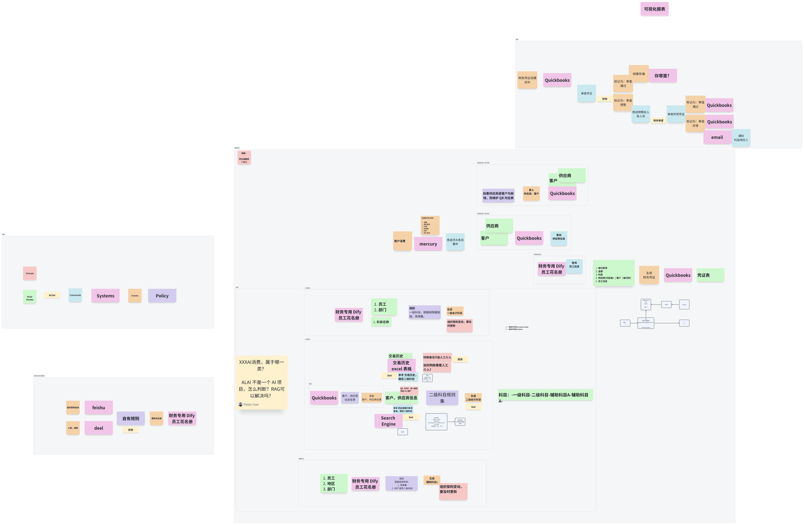

# 项目任务

做一个 use case，帮助财务人员实现 mercury 到 quickbooks 的数据同步自动化。

我的背景： Dify 解决方案架构师。我了解 Dify 的部署细节和使用。但是还没有开发过插件。

这里的用户：财务人员

需求：将 mercury 的账单通过 Dify 同步导入到 Quickbooks。

我的设计：开发一个 mercury 插件和一个 quickbooks 插件，然后在 dify 使用插件链接两个系统，具体映射逻辑交给财务来使用。

这是事件风暴的结果。
